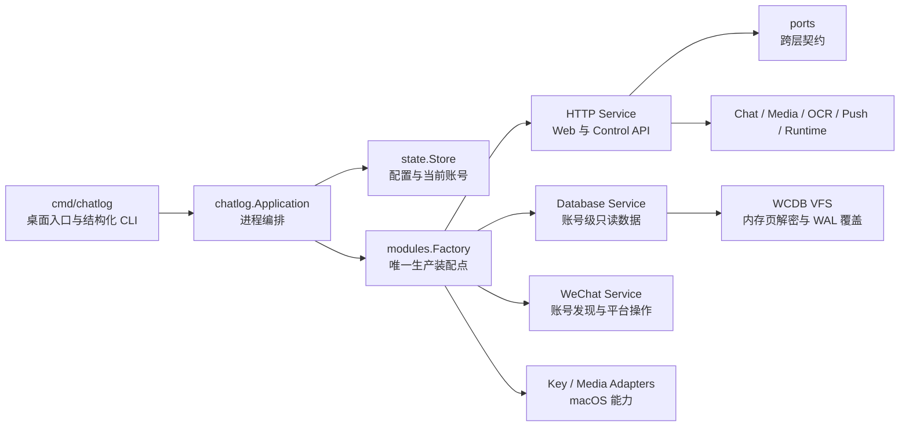

# Chatlog 架构

Chatlog Alpha 是 macOS-only 的本地 Web 应用。架构将进程级控制平面与账号级数据运行时分离：Web 设置和控制 API 常驻，账号、数据库、OCR 与推送资源可独立装配、暂停和重建。

## 总览



## 分层职责

| 层 | 位置 | 职责 |
| --- | --- | --- |
| 入口 | `main.go`、`cmd/chatlog` | 参数解析、单实例、启动应用或结构化命令 |
| 应用 | `internal/chatlog` | 生命周期、账号切换、密钥任务、浏览器打开 |
| 状态 | `internal/chatlog/state` | 唯一可变配置状态、快照、事务式持久化 |
| 端口 | `internal/chatlog/ports` | 控制、数据库、密钥、媒体、Hook、消息变更接口 |
| 装配 | `internal/chatlog/modules` | 将 macOS、WCDB、HTTP、媒体和密钥实现绑定为服务图 |
| 传输 | `internal/chatlog/http` | Web 静态资源、路由、校验、Catalog、OpenAPI、SSE |
| 业务能力 | `database`、`ocr`、`messagehook`、`wechat` | 账号级数据、识别、推送和微信操作 |
| 基础设施 | `internal/wechat`、`internal/wechatdb`、`adapters` | Darwin、Frida、WCDB、媒体编解码实现 |

依赖方向由入口和装配层指向应用契约与具体服务。传输层通过 `ports.ControlPlane` 使用应用控制能力，不持有应用实现；平台与存储实现只在 `modules.Factory` 中创建。

## 生命周期

### 启动

1. `Application.Initialize` 打开 `state.Store`，构造完整服务图并选择初始账号。
2. `StartConsole` 先启动 HTTP 与 Web 控制平面。
3. 浏览器打开控制台；没有账号或密钥时，系统设置仍保持可用。
4. 数据库配置完整时，在串行操作锁内启动账号级数据库。
5. 数据库就绪后恢复 OCR、推送、媒体键和账号缓存。

### 账号切换与配置更新

1. 控制请求进入应用操作锁和账号请求写锁；密钥任务、配置与切换不会并发发布状态。
2. 等待当前账号请求结束并暂停账号级数据生产者，使一次 HTTP 请求始终绑定同一账号代际。
3. 账号切换先停止旧数据库再提交新选择；配置更新先提交新配置再替换数据库。两条路径都完整包含在同一写锁事务内，`state.Store` 以临时文件、`fsync`、原子替换写入 `chatlog.json`。
4. 配置完整时重建数据库、刷新媒体密钥并恢复账号运行时；配置不完整时控制台继续在线。
5. 应用级监听地址的变化通过 `restart_required` 明确反馈。

Web 监听器不参与账号切换，因此设置页、任务状态和账号列表不会因数据库重启而消失。

### 关闭

进程接收 `SIGINT` 或 `SIGTERM` 后停止 HTTP 账号运行时、Web 服务和数据库，释放关联子进程与文件资源。单实例永久锁文件在进程生命周期内持有 `flock`，关闭时只释放文件描述符，避免删除锁文件造成 inode 竞争。

## 控制平面

`ports.ControlPlane` 是 Web 系统设置依赖的唯一应用接口：

- `ControlSnapshot`：只返回状态与密钥存在标记；
- `ControlAccounts`：合并运行中账号与持久账号；
- `ControlUpdate`：更新应用级或账号级配置；
- `ControlSelect`：按 PID 或账号名切换；
- `ControlStartAction`、`ControlJob`：管理异步密钥任务。

控制路由位于 `/api/v1/control/*`，在数据库就绪门禁之前注册。数据路由仍由数据库状态保护，未配置或重启期间返回明确的服务状态。

## 状态与配置

`chatlog.json` 是唯一配置文档：

- 应用级：HTTP 地址、日志保留天数、最后账号；
- 账号级：数据目录、工作目录、数据库/图片密钥、OCR 与推送设置。

`state.Store` 不暴露内部可变对象。调用方只读取快照或提交 typed update；失败的持久化会回滚内存状态。密钥、Token、Secret 在日志中统一脱敏，控制快照不返回实际密钥。

## 数据库边界

- 微信数据库始终只读；
- WCDB VFS 按 SQLite 读取请求在内存解密页面；
- WAL 已提交视图在内存覆盖，不生成完整解密数据库；
- HTTP 只依赖数据库查询端口，不创建 WCDB datasource；
- Hook 与增量消息共用数据库变更流，避免独立周期扫描。

## Web 前端

静态 Web 资源由 Go 二进制嵌入，入口位于 `internal/chatlog/http/static/index.htm`。样式集中在 `styles.css`，脚本按能力拆分为以下 12 个 ES Modules：

- `js/app.js`：浏览器入口，组合各功能动作并安装事件委派；
- `js/api.js`：共享 HTTP 客户端，统一 JSON、文本、二进制、错误、请求头、缓存、取消与超时语义；
- `js/core.js`：页面生命周期、标签页初始化、服务状态与键盘交互编排；
- `js/navigation.js`：标签页导航边界与导航处理器注入；
- `js/events.js`：基于 `data-on-*` 的事件委派与动作映射；
- `js/ui.js`：提示、转义、数值与动作参数等通用 UI 工具；
- `js/settings.js`：账号、配置与密钥任务；
- `js/runtime.js`：运行状态、日志、缓存、文件 I/O 与系统控制；
- `js/database.js`：数据库浏览、查询与导出；
- `js/analytics.js`：统计与分析；
- `js/hooks.js`：推送规则、投递队列与 Hermes 状态；
- `js/features.js`：聊天、媒体、OCR、朋友圈与 API 检查等业务功能。

浏览器端使用原生 ES Modules 与 CSS，不需要 npm、打包器或前端构建步骤。应用运行时的朋友圈精确媒体解密另需 Node.js；该依赖不参与前端资源构建。新增页面应落入独立功能模块，通过 `js/api.js` 与 Catalog 调用后端。

## 扩展方式

### 新增业务功能

1. 在对应业务包定义内部模型和服务；
2. 跨层能力先在 `ports` 定义最小接口；
3. 在 `modules.Factory` 注入实现；
4. HTTP 文件按 feature 注册路由并加入 Catalog；
5. Web 代码加入对应 ES Module，不向 `index.htm` 写内联逻辑。

### 新增存储或平台实现

1. 实现现有端口；
2. 在装配层新增 adapter binding；
3. 保持应用、HTTP 和业务服务不导入具体实现。

当前产品仅构建 macOS 实现；代码树不保留其他平台占位实现或旧配置迁移路径。

## 工程检查

```bash
make fmt-check
make vet
make build
git diff --check
```

`make release` 使用同一构建入口生成 macOS `amd64` 与 `arm64` 产物。
